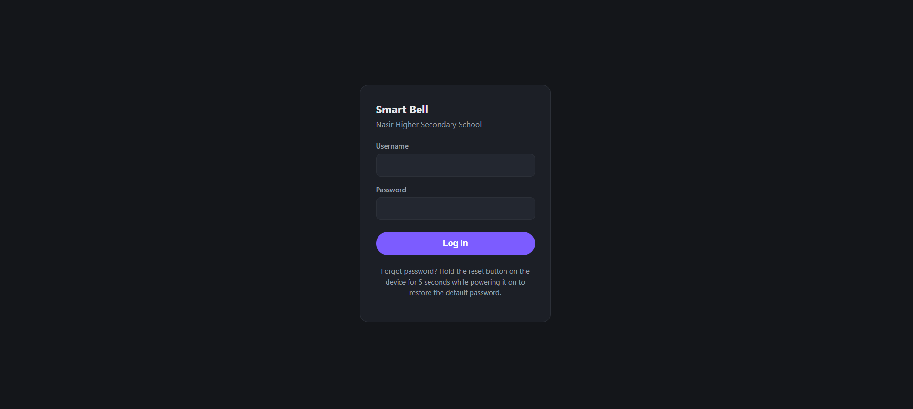
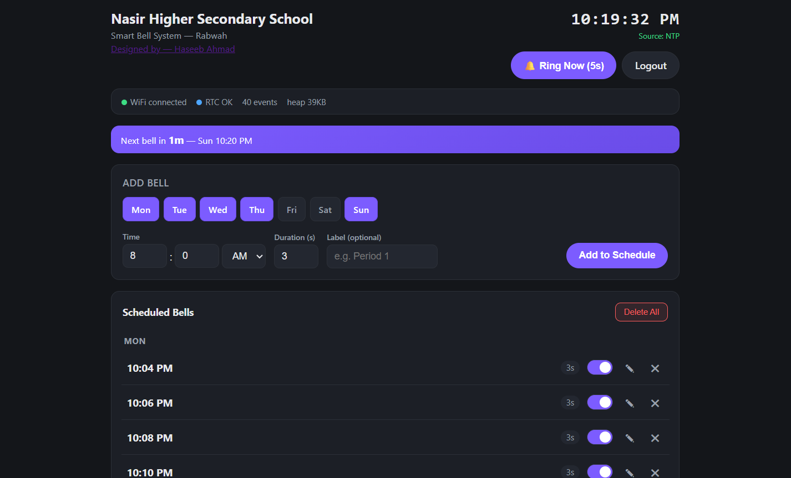
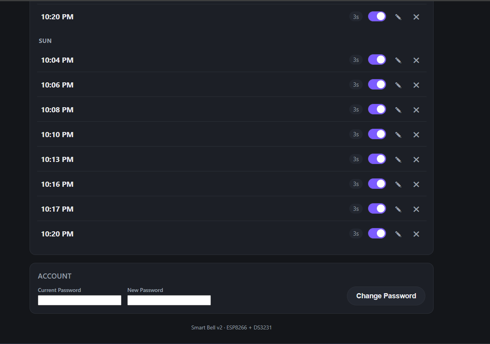

# Smart-ESP-School-Bell-

An ESP8266-based **automated school bell controller** with a web-based management interface, per-event ring duration, DS3231 RTC backup, NTP time synchronization, persistent LittleFS storage, authentication, and automatic WiFi reconnection.

Designed for **Nasir Higher Secondary School, Rabwah, Pakistan**, the system allows authorized users to manage the complete school bell schedule from a browser without requiring direct access to the ESP8266.

---

## Features at a Glance

| Feature | Detail |
| --- | --- |
| Scheduled Bells | Up to 100 scheduled events |
| Per-Event Duration | Individual bell duration from 1–15 seconds |
| Web Interface | Responsive browser-based dashboard |
| Authentication | Login, logout, sessions, and password change |
| NTP Time Sync | Synchronizes time using NTP servers |
| DS3231 RTC Backup | Maintains local time when WiFi/NTP is unavailable |
| Persistent Storage | Schedule and authentication data stored in LittleFS |
| WiFi Auto-Reconnect | Automatically reconnects when WiFi drops |
| Manual Ring | One-click 5-second manual bell |
| Event Control | Add, edit, enable/disable, delete, or clear events |
| Next Bell | Displays the next scheduled bell |
| Device Status | WiFi, RTC, time source, event count, and free heap |
| Password Recovery | Physical reset procedure restores the factory password |
| Warning LED | Pre-bell and active-bell indication |
| Self-Healing | Low-memory protection and scheduled nightly restart |
| School Schedule | Supports independent schedules for Sun–Sat |

---

## Web Interface

The Smart Bell system includes a browser-based dashboard designed for quick operation from a computer, tablet, or mobile device.

### Login Page

The system protects the dashboard behind a username/password login.



### Main Dashboard

The dashboard provides the current time, time source, WiFi/RTC status, event count, free heap, next scheduled bell, manual ringing, and schedule creation.



### Scheduled Bells & Account Management

Scheduled events can be enabled/disabled, edited, or deleted individually. The dashboard also provides password management.



---

## Hardware Required

| Component | Purpose |
| --- | --- |
| **ESP8266** (NodeMCU / compatible board) | Main microcontroller |
| **DS3231 RTC Module** | Battery-backed timekeeping |
| **CR2032 Coin Cell** | RTC backup power |
| **5V Relay Module** (Active-Low) | Controls the bell circuit |
| **Warning LED + resistor** | Visual pre-bell/ringing indication |
| **Momentary Push Button** | Physical password recovery |
| **5V Power Supply** | Powers the controller/relay system |

---

## Wiring Diagram

### DS3231 RTC

```text
ESP8266 Pin    →    DS3231
────────────────────────────
D1 (GPIO5)     →    SCL
D2 (GPIO4)     →    SDA
3.3V           →    VCC
GND            →    GND
```

### Relay

```text
ESP8266 Pin    →    Relay
────────────────────────────
D5 (GPIO14)    →    IN
5V             →    VCC
GND            →    GND
```

### Warning LED

```text
ESP8266 Pin    →    LED
────────────────────────────
D7 (GPIO13)    →    220–330Ω resistor → LED anode
GND            →    LED cathode
```

### Password Reset Button

```text
ESP8266 Pin    →    Push Button    →    GND
D6 (GPIO12)    →    Button
```

> **Important:** D1 and D2 are reserved for I2C communication with the DS3231. The relay uses D5 and must not be moved to D1.

> **Electrical safety:** Do not connect a mains-powered bell directly to an ESP8266 GPIO. Use an appropriately rated relay/contactor and proper electrical isolation.

---

## Hardware Pin Reference

| Component | ESP8266 Pin | GPIO | Function |
| --- | --- | ---: | --- |
| DS3231 SDA | D2 | GPIO4 | I2C SDA |
| DS3231 SCL | D1 | GPIO5 | I2C SCL |
| Relay | D5 | GPIO14 | Active-Low bell control |
| Warning LED | D7 | GPIO13 | Bell warning/status |
| Reset Button | D6 | GPIO12 | Password recovery |

---

## Software Setup

### 1. Install Arduino IDE Dependencies

Install the following:

- **ESP8266 Arduino Core**
- **ArduinoJson 7.x**
- **RTClib by Adafruit**

`Wire`, `time.h`, `ESP8266WiFi`, `ESP8266WebServer`, and LittleFS are provided by the ESP8266 Arduino environment.

### 2. Configure WiFi & IP

Edit the deployment configuration in `smart_bell_rtc.ino`.

Example:

```cpp
const char* ssid     = "YOUR_WIFI_SSID";
const char* password = "YOUR_WIFI_PASSWORD";

IPAddress local_IP(192, 168, 100, 27);
IPAddress gateway(192, 168, 100, 1);
IPAddress subnet(255, 255, 255, 0);
```

Replace these values with the settings for your network.

> **Security:** Do not publish real WiFi credentials or production passwords in a public GitHub repository.

### 3. Flash the Firmware

1. Open the project in Arduino IDE.
2. Select the appropriate ESP8266 board.
3. Select the correct COM port.
4. Verify the required libraries are installed.
5. Compile the project.
6. Upload the firmware to the ESP8266.
7. Open Serial Monitor and verify startup/network information.

### 4. Access the Web Interface

Once the ESP8266 is connected to the network, open its configured IP address:

```text
http://192.168.100.27
```

The actual address depends on your configuration.

---

## How to Use

### Login

1. Open the Smart Bell IP address.
2. Enter the configured username.
3. Enter the password.
4. Click **Log In**.

After authentication, the main dashboard becomes available.

### Adding a Bell Schedule

1. Open the dashboard.
2. Select one or more days.
3. Set the hour.
4. Set the minute.
5. Select AM or PM.
6. Set the duration from **1–15 seconds**.
7. Optionally enter a label such as `Period 1`.
8. Click **Add to Schedule**.

The web interface displays scheduled bells grouped by day.

### Editing a Bell

1. Find the event in **Scheduled Bells**.
2. Click the edit icon.
3. Change the time, duration, day, or label.
4. Click **Save Changes**.

### Enable / Disable a Bell

Use the toggle beside an event.

Disabled events remain stored but are ignored by the scheduler until enabled again.

### Delete a Bell

Click the delete icon beside the event.

### Delete All Bells

Click **Delete All** and confirm the operation.

This removes the complete scheduled bell list.

### Manual Bell

Click:

```text
Ring Now (5s)
```

The bell activates immediately for five seconds.

---

## Time Management

The system uses a hybrid time architecture based on **NTP + DS3231 RTC**.

### Time Source Priority

```text
             ┌───────────────┐
             │   NTP Sync    │
             │   Available?  │
             └───────┬───────┘
                     │
              Yes    │    No
               ↓     │     ↓
        ┌──────────┐ │ ┌──────────┐
        │ NTP Time │ │ │ DS3231   │
        └────┬─────┘ │ │ RTC Time │
             │       │ └────┬─────┘
             ↓       │      │
        Sync RTC     │      ↓
                     │  Continue
                     │  from RTC
```

### NTP

The firmware uses NTP servers including:

```text
pool.ntp.org
time.google.com
```

Pakistan Standard Time is configured using:

```text
PKT-5
```

The RTC is periodically synchronized from NTP.

### DS3231 Fallback

If WiFi/NTP is unavailable but the DS3231 contains a valid time, the controller can continue operating from the RTC.

This means a temporary Internet or WiFi outage does not necessarily stop scheduled bells.

---

## RTC / NTP Behavior

| Scenario | Behavior |
| --- | --- |
| WiFi connected + NTP available | Uses synchronized NTP/system time |
| WiFi temporarily unavailable | Uses DS3231 RTC when valid |
| Power restart + WiFi unavailable | DS3231 can provide the stored local time |
| WiFi returns | NTP synchronization resumes |
| RTC unavailable + NTP unavailable | No reliable time source; scheduled bells cannot operate correctly |

The dashboard indicates the active time source.

```text
NTP  → Network time
RTC  → DS3231 fallback
```

---

## Authentication & Security

The v2 web interface includes:

- Username/password login
- HTTP session authentication
- Logout
- Maximum concurrent sessions
- Password change
- Physical password recovery
- Protected API endpoints

### Password Change

The dashboard includes:

```text
Current Password
New Password
Change Password
```

### Password Recovery

If the password is forgotten:

1. Power off the controller.
2. Hold the physical reset button.
3. Power on the ESP8266 while continuing to hold the button.
4. Hold the button for approximately 5 seconds.
5. Release the button after the reset sequence.

The firmware restores the configured factory password.

> Change the factory password immediately after initial setup.

### Network Security

The current web server uses HTTP rather than HTTPS.

Therefore:

- Do not expose the ESP8266 web server directly to the public Internet.
- Keep the controller on a trusted LAN or isolated VLAN.
- Use a strong administrator password.
- Avoid committing credentials to GitHub.

---

## Persistent Storage

The system uses **LittleFS** to store persistent data on the ESP8266 flash filesystem.

The project stores:

```text
/data.json
/auth.json
```

### Schedule Storage

Scheduled bell events survive normal reboot and power loss because they are saved to LittleFS.

### Authentication Storage

Authentication configuration is also stored persistently.

Formatting LittleFS will erase stored application data, so do not format the filesystem unless you intentionally want to reset the stored data.

---

## Bell Scheduling

Each scheduled event contains information such as:

```text
Day
Hour
Minute
Duration
Enabled/Disabled
Optional Label
```

The firmware internally uses a 24-hour time representation, while the web interface provides a 12-hour AM/PM input.

### Event Limits

| Setting | Value |
| --- | ---: |
| Maximum scheduled events | 100 |
| Minimum duration | 1 second |
| Maximum duration | 15 seconds |
| Maximum label length | 24 characters |
| Manual ring duration | 5 seconds |

---

## Web API

The dashboard communicates with the ESP8266 using HTTP endpoints.

### Authentication

| Method | Endpoint | Purpose |
| --- | --- | --- |
| GET | `/login` | Login page |
| POST | `/login` | Authenticate |
| GET | `/logout` | End session |

### Status & Events

| Method | Endpoint | Purpose |
| --- | --- | --- |
| GET | `/api/status` | Device/time status |
| GET | `/api/events` | Retrieve scheduled events |
| POST | `/api/events/add` | Add scheduled event |
| POST | `/api/events/update` | Update an event |
| POST | `/api/events/toggle` | Enable/disable event |
| POST | `/api/events/delete` | Delete event |
| POST | `/api/events/clear` | Delete all events |
| POST | `/api/ring` | Manual 5-second ring |

### Account

| Method | Endpoint | Purpose |
| --- | --- | --- |
| POST | `/api/account/password` | Change password |

State-changing operations use POST requests.

---

## Dashboard Status

The main dashboard reports:

```text
WiFi connected
RTC OK
NTP / RTC time source
Number of scheduled events
Free heap
Next scheduled bell
```

The clock is updated smoothly in the browser between periodic status requests.

The dashboard polls:

| Data | Interval |
| --- | ---: |
| Device status | 10 seconds |
| Scheduled events | 30 seconds |
| Display clock | 1 second |

---

## Warning LED

The warning LED provides a visual indication around scheduled bell events.

The firmware can use the LED for:

- Pre-bell warning
- Active bell indication
- System status

The warning period begins approximately **10 seconds before** a scheduled bell.

---

## Reliability & Self-Healing

The firmware includes basic automatic recovery mechanisms.

### Low-Memory Protection

The controller monitors available heap memory.

If free heap falls below the configured safety threshold, the ESP8266 restarts to recover from a potential memory exhaustion condition.

### Scheduled Nightly Restart

The controller can automatically restart around:

```text
03:00 local time
```

The restart is avoided while the bell is actively ringing.

This is intended to improve long-running reliability in a school environment.

---

## Project Structure

```text
Smart-ESP-School-Bell/
├── smart_bell_rtc.ino       # Main ESP8266 firmware
├── page.h                   # Main web dashboard
├── login_page.h             # Login page
├── README.md                # Project documentation
├── LICENSE                  # Project license
├── CONTRIBUTING.md          # Contribution guidelines
├── .gitignore               # Git ignore rules
│
└── images/
    ├── login-page.png       # Login interface screenshot
    ├── dashboard.png        # Main dashboard screenshot
    └── schedule-account.png # Schedule/account screenshot
```

---

## Configuration Reference

| Setting | Default / Example | Description |
| --- | --- | --- |
| `RELAY_PIN` | `D5` | Relay output |
| `LED_PIN` | `D7` | Warning LED |
| `BUTTON_PIN` | `D6` | Password reset button |
| `SDA` | `D2` | DS3231 SDA |
| `SCL` | `D1` | DS3231 SCL |
| `MY_TZ` | `PKT-5` | Pakistan Standard Time |
| NTP interval | `3600s` | Periodic NTP synchronization |
| Maximum events | `100` | Maximum stored scheduled events |
| Ring duration | `1–15s` | Per-event duration range |
| Manual ring | `5s` | Manual ring duration |
| Warning lead time | `10s` | Pre-bell warning period |
| Maximum sessions | `3` | Concurrent authenticated sessions |

---

## Troubleshooting

### Bell rings at the wrong time

Check:

1. DS3231 wiring.
2. RTC time.
3. NTP synchronization.
4. Timezone configuration.
5. WiFi connection.
6. Static IP/network configuration.

### RTC is not detected

Verify:

```text
D1 / GPIO5 → SCL
D2 / GPIO4 → SDA
3.3V       → VCC
GND        → GND
```

### WiFi disconnects

The firmware attempts automatic reconnection.

If the network is unavailable, the DS3231 can provide the fallback time when valid.

### Scheduled events disappear

Check that LittleFS has not been formatted or erased.

The schedule is stored persistently in the ESP8266 filesystem.

### Password forgotten

Use the physical password-reset button procedure described above.

### Relay does not activate

Check:

- D5 / GPIO14 wiring
- Relay module power
- Common ground
- Active-low relay logic
- Relay module compatibility
- External bell/contactor wiring

---

## Known Limitations

- The ESP8266 is a resource-constrained microcontroller and is not intended to function as a full enterprise web server.
- The web interface currently uses HTTP rather than HTTPS.
- If both NTP and the DS3231 are unavailable, the scheduler cannot determine the correct time.
- LittleFS flash memory has finite write endurance; avoid unnecessary repeated writes.
- Bell timing can experience very small execution delays under heavy microcontroller/network activity.
- The system should be deployed on a trusted local network rather than exposed directly to the Internet.

---

## Security Recommendations

Before publishing the repository publicly:

- Remove real WiFi SSIDs/passwords.
- Remove production administrator passwords.
- Replace deployment-specific network information where appropriate.
- Consider using a private configuration header.
- Add the configuration header to `.gitignore`.
- Never expose the ESP8266 HTTP server directly to the public Internet.

Recommended future structure:

```text
Smart-ESP-School-Bell/
├── smart_bell_rtc.ino
├── config.example.h
├── config.h              # Local only; do not commit
├── page.h
├── login_page.h
└── .gitignore
```

---

## Contributing

Contributions, bug reports, hardware improvements, and feature suggestions are welcome.

For development changes, test the controller on a safe bench setup before connecting it to the actual school bell circuit.

See `CONTRIBUTING.md` for project-specific contribution guidelines.

---

## License

This project is licensed under the **MIT License**.

See `LICENSE` for the complete license text.

---

## Author

Developed for:

**Nasir Higher Secondary School, Rabwah, Pakistan**

**Designed by Haseeb Ahmad**

GitHub:

https://github.com/haseebahmad-cmd

The system can be adapted for other institutions requiring an automated bell, alarm, timetable, or scheduled relay-control system.
